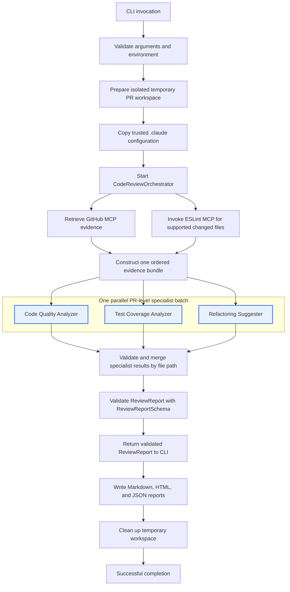
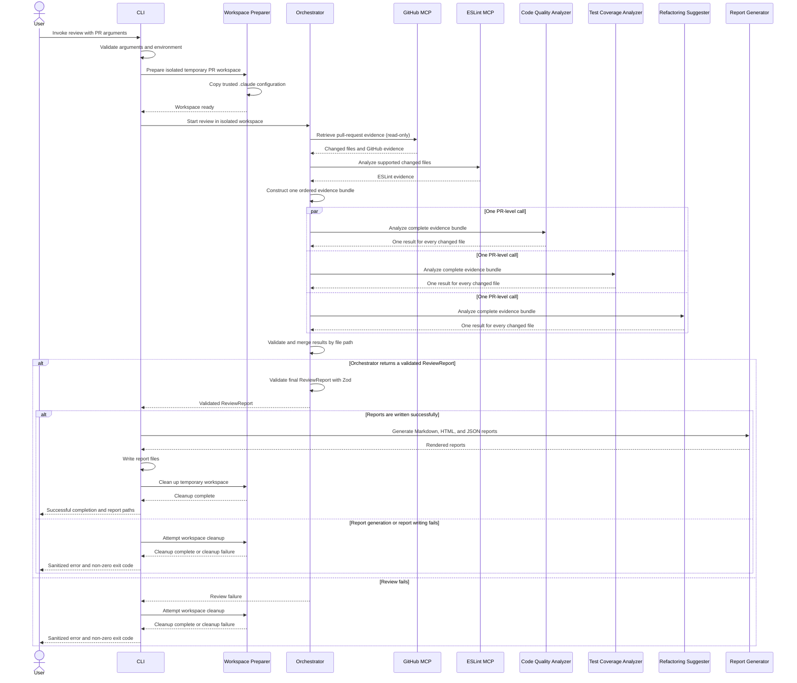

# Review Execution Flow

This document visualizes the runtime flow of the multi-agent pull-request
review system. It complements the architecture decision record for PR-level
specialist batching.

## High-level flow

## Runtime sequence

## Safety boundaries

The review workspace is temporary and isolated. Target repository scripts and
dependencies are not executed. GitHub MCP usage during analysis is read-only,
and write-capable tools are prohibited. Specialist delegation is limited to the
three configured agents; duplicate specialist invocation aborts the review.

Prompts, patches, source contents, credentials, and tool payloads are not
written to lifecycle logs.
